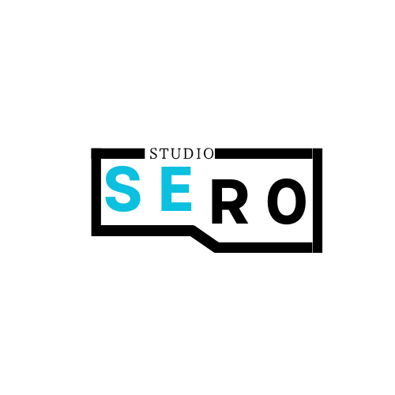

<a name="readme-top">

<br/>

<br />
<div align="center">
  <a href="https://github.com/Maerona03/">
    
  </a>

  <h3 align="center">Grade Management</h3>
</div>

<div align="center">
  A simple student Grade Calculator allows students to input their grades for each subject and automatically calculates the overall average. This tool helps students easily track their performance across different subjects and get a clear view of their general average.
</div>

<br />


[](https://wakatime.com/badge/user/018f030b-8e47-42e2-9e2a-52b75c89a316/project/cb55182a-f400-43c5-a7c1-ee527655cb9f)


---

<br />
<br />

<!-- TODO: If you want to add more layers for your readme -->
<details>
  <summary>Table of Contents</summary>
  <ol>
    <li>
      <a href="#overview">Overview</a>
      <ol>
        <li>
          <a href="#key-components">Key Components</a>
        </li>
        <li>
          <a href="#technology">Technology</a>
        </li>
      </ol>
    </li>
    <li>
      <a href="#rule,-practices-and-principles">Rules, Practices and Principles</a>
    </li>
    <li>
      <a href="#resources">Resources</a>
    </li>
  </ol>
</details>

---

## Overview

<!-- TODO: To be changed -->
<!-- The following are just sample -->
Description of the project in details.

Guiding Question:
- What is the project
     This project is a student grade calculator where in it can enter student name and input five grade to get the total grade average.
- Whats the purpose
     To help students efficiently track and manage their grades across different subjects. This  provides a quick and accurate way to monitor academic performance, allowing students to identify areas for improvement and stay on top of their grades throughout the semester.
- What are key components
- What technology used and how it is used

### Key Components
<!-- TODO: List of Key Components -->
<!-- The following are just sample -->
- MultiPage Website/Single Page Website
- Parallax transition
- Transactional

### Technology
<!-- TODO: List of Technology Used -->


## Rules, Practices and Principles
1. Always use `WD-` in the front of the Title of the Project for the Subject followed by your custom naming.
2. Do not rename any .html files; always use `index.html` as the filename.
3. Place Files in their respective folders.
4. All file naming are in camel case.
   - Camel case is naming format where there is no white space in separation of each words, the first word is in all lower case while the succeding words first letter are in upper followed by lower cased letters.
   - ex.: buttonAnimatedStyle.css
5. Use only `External CSS`.
6. Renaming of Pages folder names are a must, and relates to what it is doing or data it holding.
7. File Structure to follow below.

```
WD-ProjectName
└─ assets
|   └─ css
|   |   └─ style.css
|   └─ img
|   |   └─ fileWith.jpeg/.jpg/.webp/.png
|   └─ js
|       └─ script.js
└─ pages
|  └─ pageName
|     └─ assets
|     |  └─ css
|     |  |  └─ style.css
|     |  └─ img
|     |  |  └─ fileWith.jpeg/.jpg/.webp/.png
|     |  └─ js
|     |     └─ script.js
|     └─ index.html
└─ index.html
└─ readme.md
```

## Resources

<!-- TODO: Add References -->
| Title | Purpose | Link |
|-|-|-|
| Canva | Background and logo. | https://www.canva.com/design/DAGditiSiC8/ts7JeDqFsFdyZaesJX1Nqg/edit  |
